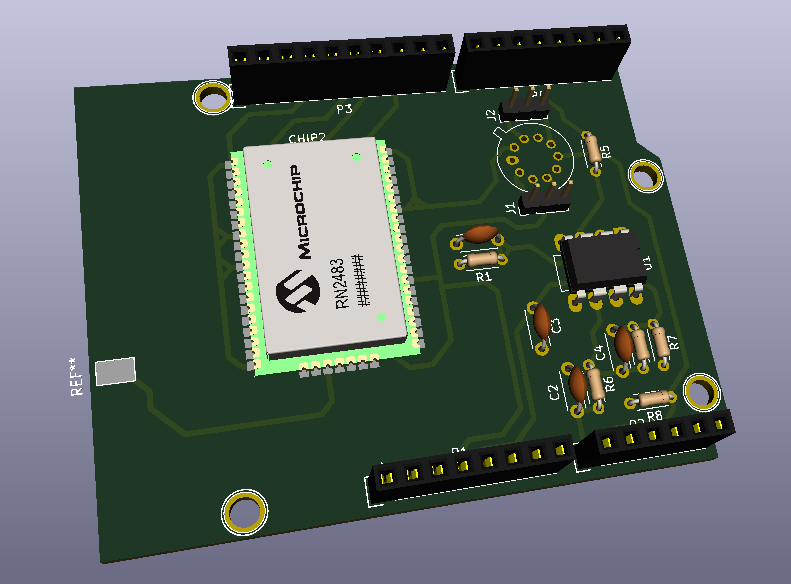

# MOSH_2020_FONTAINE_FLOUTARD
Source files for the M&OSH project ISS 2019-2020: PCB files, Arduino files and node-red files.


## Table of content

1. [Realisation of the PCB](#Realisation-of-the-PCB)
    1. [Schematic](#schematic)
        1. [Amplifier stage](#amplifier-stage)
        1. [Lora Radio](#lora-radio)
        1. [Arduino connection](#arduino-conetion)
        1. [Gas sensor](#gas-sensor)
    1. [PCB](#pcb)
    1. [3D view](#3d-view)
1. [Arduino code](#arduino-code)
1. [Node Red](#node-red)


# Realisation of the PCB

## Schematic 


The schematic is composed of three 4 parts:

1. The Amplifier stage (on the top-left)
1. The Lora Tx Radio Chip (on the top-middle)
1. The Arduino connection (on the top-right)
1. The Gas sensor connection (on the bottom-left)

### Amplifier stage


This stage is compose of several filters and an operational amplifier. The role of this stage is to filter and amplificate the signal before the analog to digital conversion of the Arduino. 

We used the software LTSpice in order to simulate this analog circuit. This simulator allows us to create all schematics we want and simulate them with different parameter. For example, we can plot the bode diagram of a circuit in order to find his cut-off frequency.

The first objective was to have an amplification. For this, we use an operational amplifier: the LTC1050. It is a "precision zero-drift" amplifier with a low noise and can be powered by a 5V input. The goal was to have an output of 1.1V for an input of 110nA. As it can be seen on the above screenshot of LTSpice, the goal is achieved.


We want to measure the input current in the system. As the input current of an ideal amplifier is null, all the current will go into R2 resistor of 100kΩ. So the input of the amplifier we want to get is the voltage of the R2 resistor. For example, with 110nA, the voltage will be 11mV. And as we want an output of 1.1V, the amplification should be 100.

As the montage is non-inverting, the gain can be set with R3 and R5 resistors. The gain is 1+R5/R3. So to get a gain of 100, we can choose R5=100kΩ and R3=1kΩ.

The second objective of the system is to filter the signal to reduce the noise. For that, we use 3 different filters. The first one is a simple RC low pass filter with a cut-off frequency of 1/(2*π*R1*C1) an filters the input current.  The second filter is an active filter with C3 and R5 which is used with the amplifier and the last filter is a low pass filter with R4 and C2 which filter the output voltage. The C4 capacitor is here to filter the alimentation noise.

On the screenshot below, we can see the bode diagram of the circuit.


### Lora Radio


We connected the only the pin we use on the Lora radio:
* Reset
* RX
* TX
* Antenna
* 3.3 V
* Ground

### Arduino connection


This schematic was automatically created by Kicad. It is composed of the connector of the shield for the Arduino board.
We connected the following ports:
* Lora TX
* Lora RX
* Reset
* Gas_Sensor_Out
* Temp_Sensor

### Gas sensor


We connected the output of the gas sensor to two jumper. So it is easy to switch from one sensor to the over. 

We also connected the temperature output to the Arduino.


## PCB

The PCB was designed in order to be simple to realize and to use. 

Main features are the following:
* We can choose the input of the gas sensor by changing jumpers
* The TX Lora radio can be welded directly on the board
* An antenna can be added to the PCB 
* The bottom layer is connected to the ground (green)
* The face layer is makes connection between components


## 3D view

The view in 3D:



The source file of the PCB are in the folder [PCB](https://github.com/MOSH-Insa-Toulouse/MOSH_2020_FONTAINE_FLOUTARD/tree/master/PCB)

## Arduino code

The [Arduino source code](https://github.com/MOSH-Insa-Toulouse/MOSH_2020_FONTAINE_FLOUTARD/tree/master/Arduino) is based on the code given by TTN for Lora communication with Arduino. 

The Lora radio sends messages to a TTN gateway. We had to create an account on TTN and add a new project with a new devices.
We chose to use the APB method for connection. 
We created the keys on TTN and added them on the code.

```
const char *devAddr = "26011***";
const char *nwkSKey = "AB82F28D15AC415AA427************";
const char *appSKey = "BA1BF3F2E70ECD142F8*************";

join_result = myLora.initABP(devAddr, appSKey, nwkSKey);
```


We created two different code:

* *Send the gas sensor value*

In order to read the value from the gas sensor, we used `analogRead()`. We sent the value with the Lora radio.

* *Send an alert when value is too high*

We also implemented a code which send an alert if the value from the gas sensor is too high. This code use an interrupt attach to pin 2. 

## Node Red

The last of our project was to retrieve data from TTN on Node red. 

We use the TTN node red library:


We fill the TTN block with the correct data from TTN:


